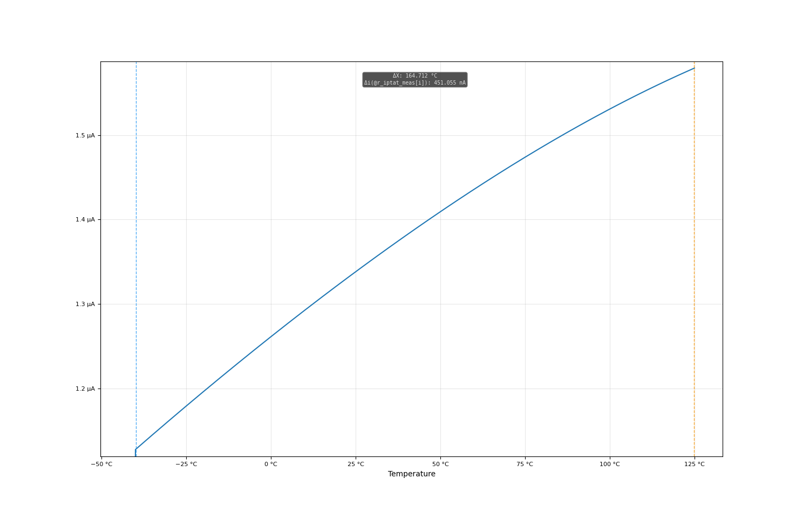
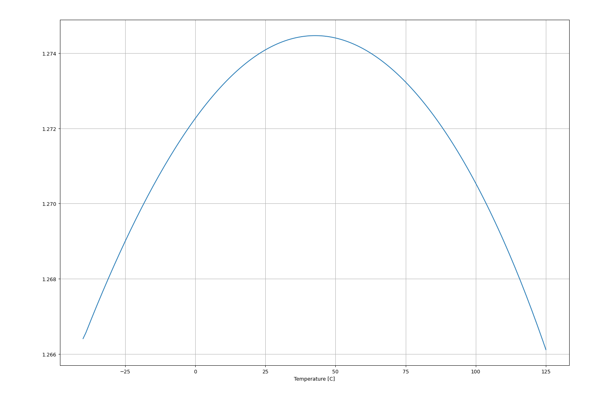
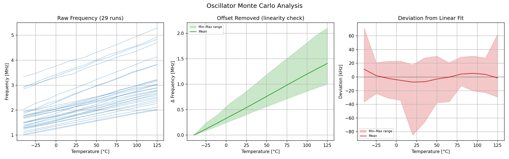
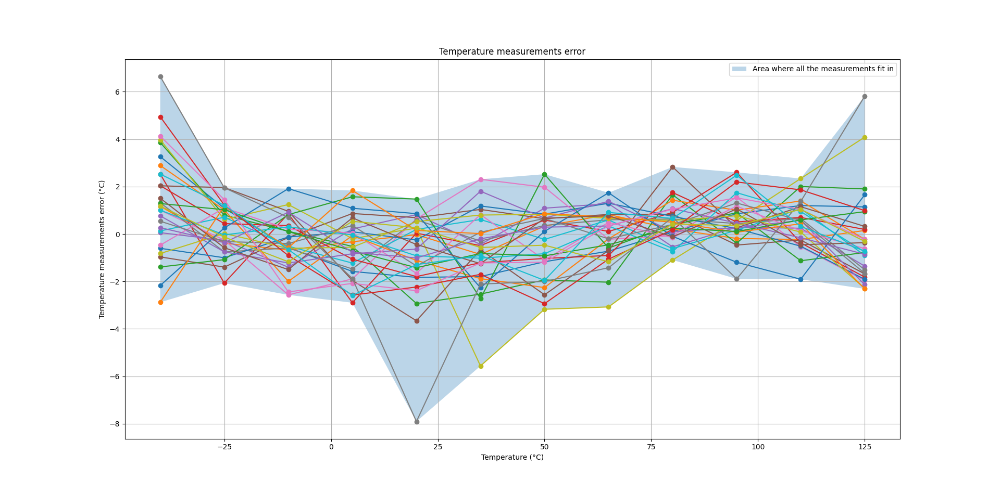

# Skywater 130nm Temperature sensor

## Who
Nicolas, Nikolai and Walter, aka. Group 1

## Why

### Bandgap module

In order to measure temperature with an electrical circuit, we need to make some kind of electrical phenomenon which depends on temperature. Here we chose to generate a current.

### Oscillator module

To avoid having to make an ADC, the current that scales linearly with temperature can be converted into a frequency. If we can do this, then it will be less accurate than with a good ADC, but also way less complex, because frequency can be read without an ADC.

## How

### Bandgap module

The bandgap works since the voltage across our "diodes" (two diode-connected PNP transistors) will vary based on a factor of kT/q  where T is the temperature in kelvin (and the size). So, both our diodes have a known voltage drop VD1 and VD2 which depends on the temperature. In order to use this voltage drop to create a varying output current we set a resistor above one of the diodes. Then we force the voltage above the resistor VR1 (12 * 7.535kΩ = 90.42kΩ) to be the same as the voltage above the other diode Q2 using an OTA. The voltage drop across the resistor (and thus the current) will then be VR1 - VD1, or VD2 - VD1. By setting the diodes at different sizes, we will then get a temperature dependent current through the loop.

We then use current mirrors to mirror this to two different branches. One is a constant voltage (VREF), and one varies with temperature (IPTAT). VREF is constant because it is set by resistors (70.667 * 7.535kΩ = 532.473kΩ). IPTAT is not locked by resistors, and therefore varies with temperature. Afterwards, these go into the oscillator to be compared.

### Oscillator module

The oscillator works by using these two signals as inputs. The IPTAT current charges a capacitor, and also goes into the negative input of an OTA. The VREF goes into the positive input of the same OTA. When IPTAT has charged the capacitor, the voltage on this node will eventually rise above the positive input. When this happens, there will be an output after a certain delay, caused by the inverters. This output then turns on a transistor in parallel with the charging capacitor, which will empty it. This process generates one period of an oscillating output signal, which will increase in frequency with the current charging the capacitor, and therefore temperature. This means we have successfully generated a frequency that scales relatively linearly with temperature. The slight non-linearity of this will be the temperature inaccuracy, which needs to be minimized. This will also be affected by variations in the die of the final tapeout.

Waveforms are shown below

## Key parameters

| Parameter             | Min     | Typ             | Max     | Unit  |
| :---                  | :---:   | :---:           | :---:   | :---: |
| Technology            |         | Skywater 130 nm |         |       |
| AVDD                  | 1.7     | 1.8             | 1.9     | V     |
| Oscillation frequency | 1.7     | 2.3             | 3.1     | MHz   |
| Temperature           | -40     | 27              | 125     | C     |

## Simulation Graphs

### Bandgap

 Figure 3: IPTAT simulated with a sweeping temperature between -40 and 125 degrees C. A 1k resistor has been placed between IPTAT node and ground to measure this. 

 Figure 4: VREF simulated with a sweeping temperature between -40 and 125 degrees C. It is fairly constant, only varying with a delta of about 4mV.

### Oscillator: typical

### Oscillator: Montecarlo simulations

 Figure 1: Results of Montecarlo simulations of the bandgap and osciallator setup at different temperatures. 

 Figure 2: Estimated error in the temperature measurements with two points calibration for Montecarlo simualations. The results seem good if we not take in account the gray and yellow curves that deviate a lot. The operating point for these two curves has probably not been established correctly during the simulations. 

## What

| What                 |        Cell/Name                       |
| :----                |  :----:                                |
| Schematic Top level  | design/LELO_GR01_SKY130A/LELO_GR01.sch |
| Schematic Oscillator | design/LELO_GR01_SKY130A/oscillator.sch|
| Schematic Bandgap    | design/LELO_GR01_SKY130A/bandgap.sch   |
| Schematic Diff Amp   | design/LELO_GR01_SKY130A/diffamp_1.sch |
| Schematic GM Cell    | design/LELO_GR01_SKY130A/GM_cell.sch   |

## Signal interface

### Top level
| Signal       | Direction | Domain  | Description                               |
| :---         | :---:     | :---:   | :---                                      |
| VDD_1V8      | Input     | VDD_1V8 | 1.8V Main supply                          |
| VSS          | Input     | Ground  |                                           |
| PWRUP_1V8    | Input     | VDD_1V8 | Power up the circuit                      |
| OSC_TEMP_1V8 | Output    | VDD_1V8 | Temperature dependent frequency           |

### Bandgap
| Signal       | Direction | Domain  | Description                                    |
| :---         | :---:     | :---:   | :---                                           |
| VDD_1V8      | Input     | VDD_1V8 | 1.8V Main supply                               |
| VSS          | Input     | Ground  |                                                |
| PWRUP_1V8    | Input     | VDD_1V8 | Power up the circuit, not currently used       |
| VREF         | Output    | VDD_1V8 | 1.27V reference voltage generated              |
| IPTAT        | Output    | VDD_1V8 | PTAT current which increases with temperature  |

### Oscillator
| Signal       | Direction | Domain  | Description                               |
| :---         | :---:     | :---:   | :---                                      |
| VDD_1V8      | Input     | VDD_1V8 | 1.8V Main supply                          |
| VSS          | Input     | Ground  |                                           |
| VREF_BG      | Input     | VDD_1V8 | 1.27V reference voltage generated         |
| IBP_B        | Input     | VDD_1V8 | PTAT current to drive the oscillations    |
| OSC_TEMP_1V8 | Output    | VDD_1V8 | Temperature dependent frequency           |

### Diffamp
| Signal       | Direction | Domain  | Description                               |
| :---         | :---:     | :---:   | :---                                      |
| VDD_1V8      | Input     | VDD_1V8 | 1.8V Main supply                          |
| VSS          | Input     | Ground  |                                           |
| VIP          | Input     | VDD_1V8 | Positive input voltage                    |
| VIN          | Input     | VDD_1V8 | Negative input voltage                    |
| VOUT         | Output    | VDD_1V8 | Output voltage                            |

### GM Cell
| Signal       | Direction | Domain  | Description                               |
| :---         | :---:     | :---:   | :---                                      |
| VDD_1V8      | Input     | VDD_1V8 | 1.8V Main supply                          |
| VSS          | Input     | Ground  |                                           |
| IBP          | Output    | VDD_1V8 | Output current, approx 10uA at 27C        |
